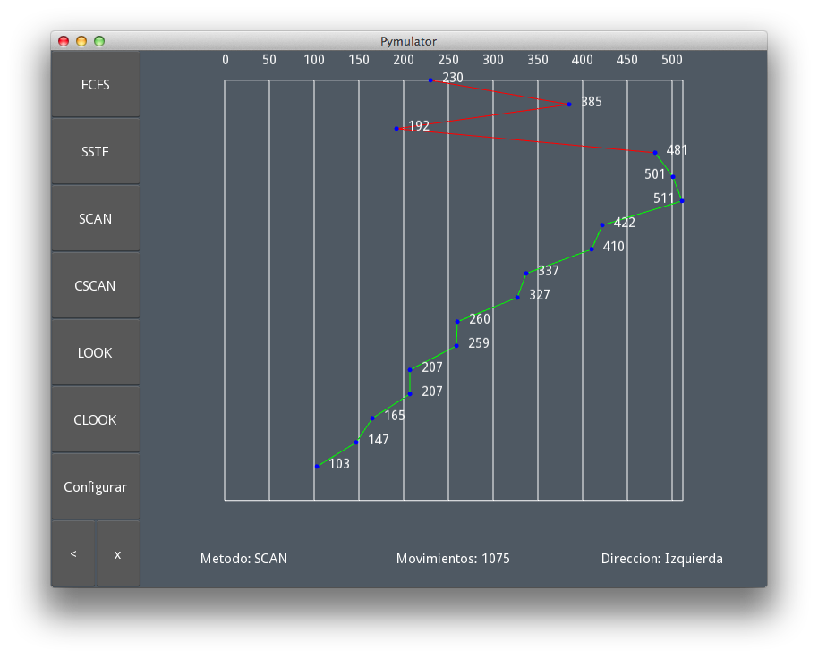

Disk Scheduling Simulator
=========================

This is a simulator written in Python 2.7 using [Kivy Framework][1].

It allows the user to simulate a 512 tracks hdd, and compare the perfomance of
different scheduling algorithms.

Dependencies:
-------------

* [Python 2.7+][2]
* [Kivy][1]

How to use it:
--------------

Open a terminal

    $ git clone https://github.com/farfanoide/simuladorHDD
    $ cd simuladorHDD
    $ cp settings/pymulator.ini{.example,}
    $ python main.py # on a Mac change this to: $ kivy main.py

Windows Users:
--------------

* [Microsoft Visual C++ 2008 SP1 Redistributable Package (x86)][5] or
[Microsoft Visual C++ 2008 SP1 Redistributable Package (x64)][6]

* [Download][4]. Extract and execute pymulator.exe

Setup the simulator with the config screen (shortcut: F1) and go to the
graphics screen to see the results.

Contributing:
-------------

Send us your pull request.

[Docstring conventions used][3]

<!-- Links -->
[1]: http://kivy.org
[2]: http://www.python.org/
[3]: http://www.python.org/dev/peps/pep-0257/
[4]: http://cl.ly/2M1j0Q2Q0b3N
[5]: http://www.microsoft.com/en-us/download/details.aspx?id=5582
[6]: http://www.microsoft.com/en-us/download/details.aspx?id=2092